# 📖 Book Ecommerce Website

> A fully responsive Angular-based online book store with browsing, cart management, order placement, and user authentication — powered by Local Storage.

🌐 **Live Demo:** [books-ecommerce-website-three.vercel.app](https://books-ecommerce-website-three.vercel.app/)

---

## 🌟 Features

- 📚 **Book Listings** — Browse all available books with category filters
- 🔍 **Search** — Find books quickly by title or keyword
- 📖 **Book Details** — View detailed info for each book
- 🛒 **Shopping Cart** — Add, update, and remove books from cart
- 📦 **Order Form** — Place orders with a structured form
- 🔐 **Login / Signup** — User authentication with modal login
- 💬 **Testimonials** — Customer reviews and feedback
- ℹ️ **About Us** — Team and mission overview
- 📞 **Contact Page** — Get in touch form
- 💾 **Local Storage** — All data persisted in browser Local Storage

---

## 🖥️ Desktop Screenshots

| | |
|---|---|
| 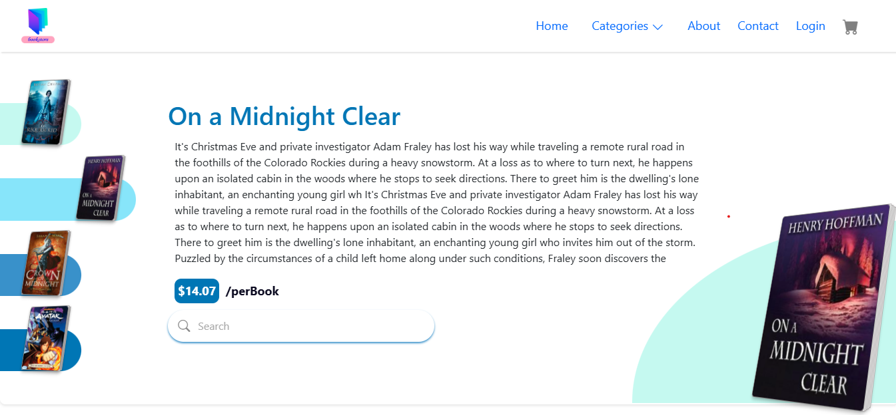 |  |
| 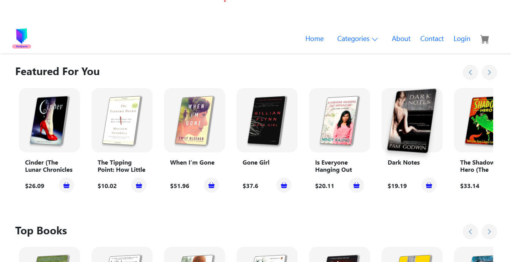 | 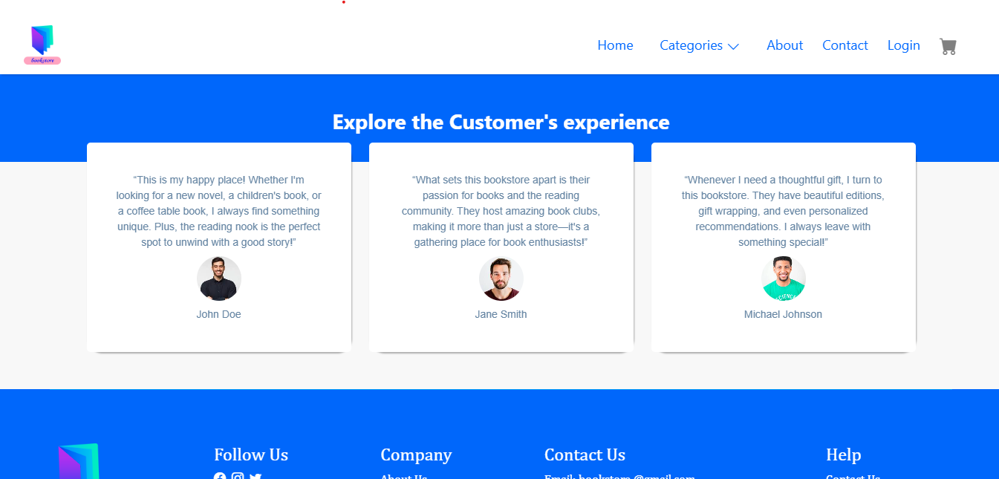 |
| 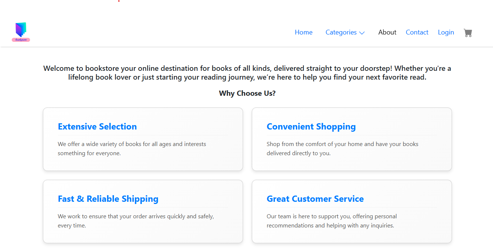 | 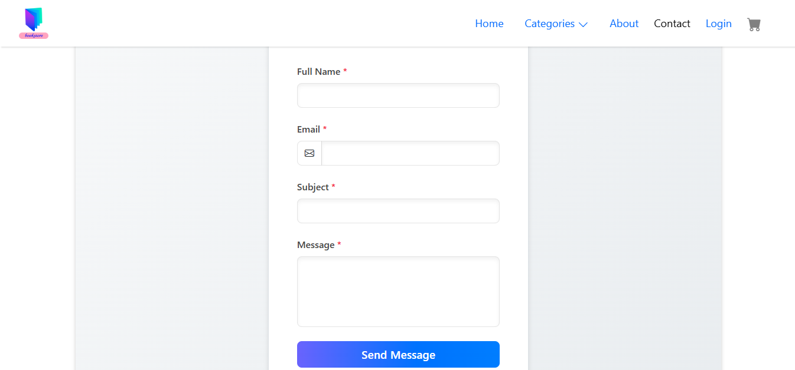 |
| 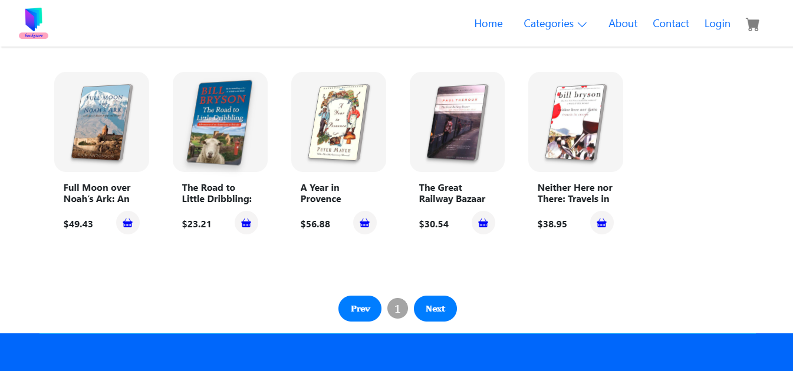 | 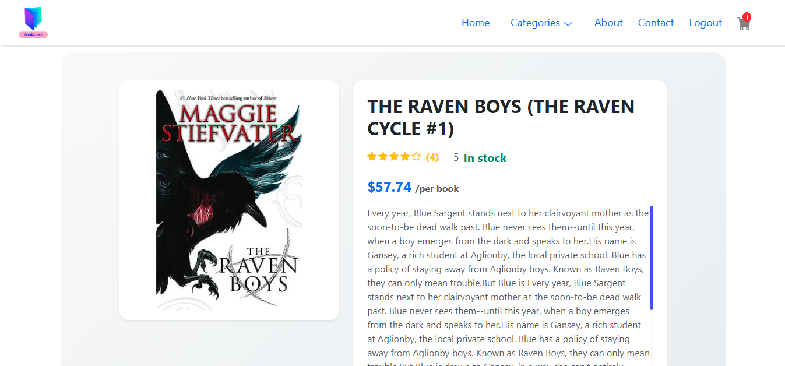 |
| 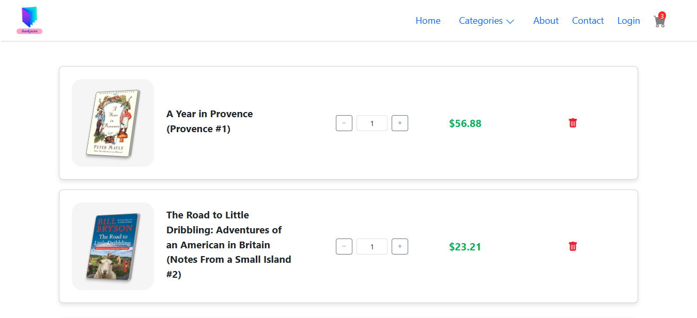 | 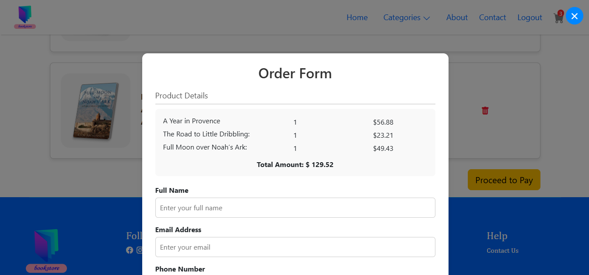 |

---

## 📱 Mobile Screenshots

<div style="display: grid; grid-template-columns: repeat(auto-fill, minmax(200px, 1fr)); gap: 10px;">
  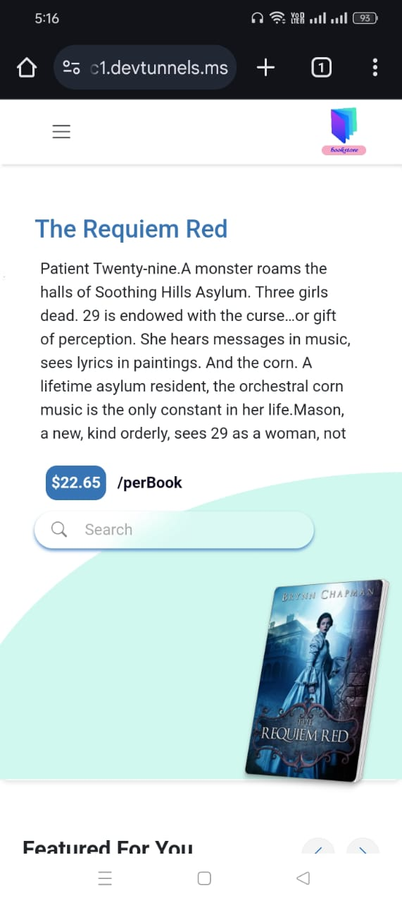
  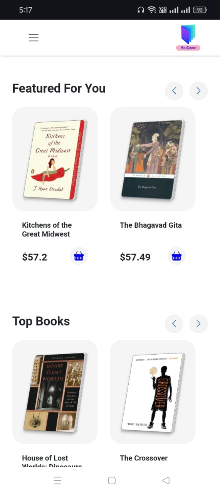
  
  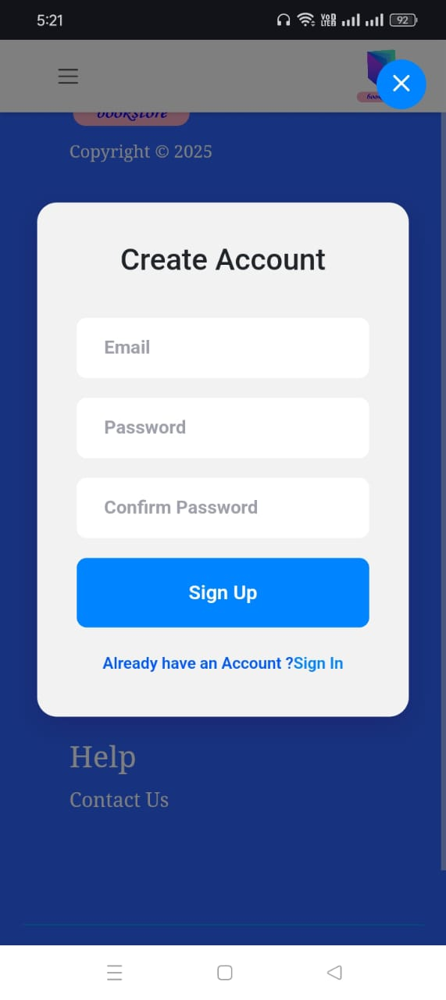
  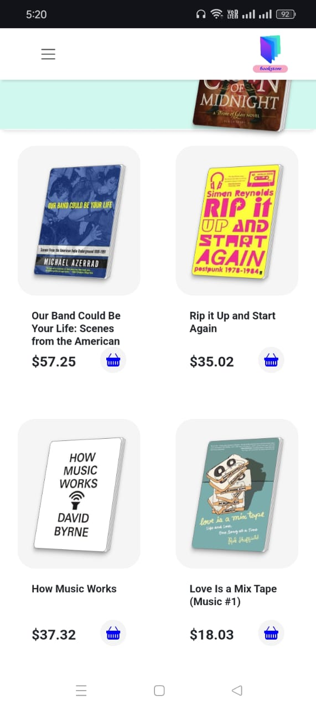
  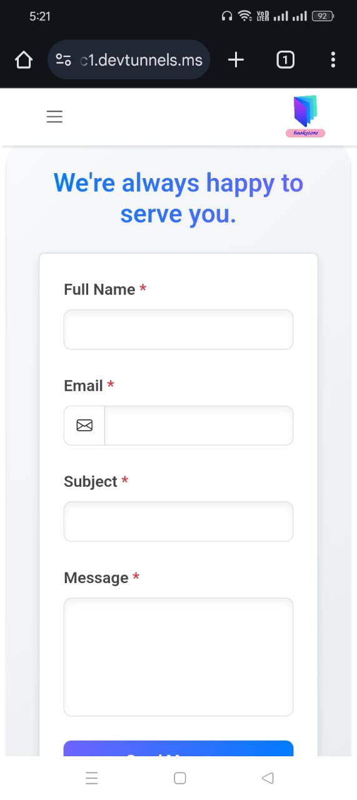
  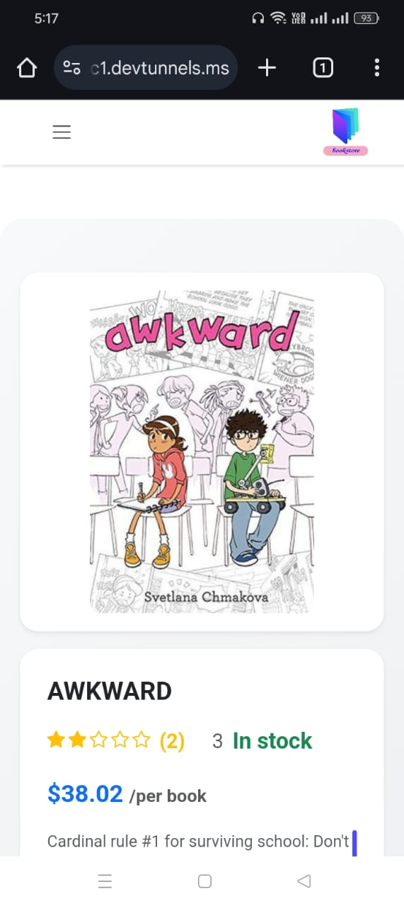
  
  
  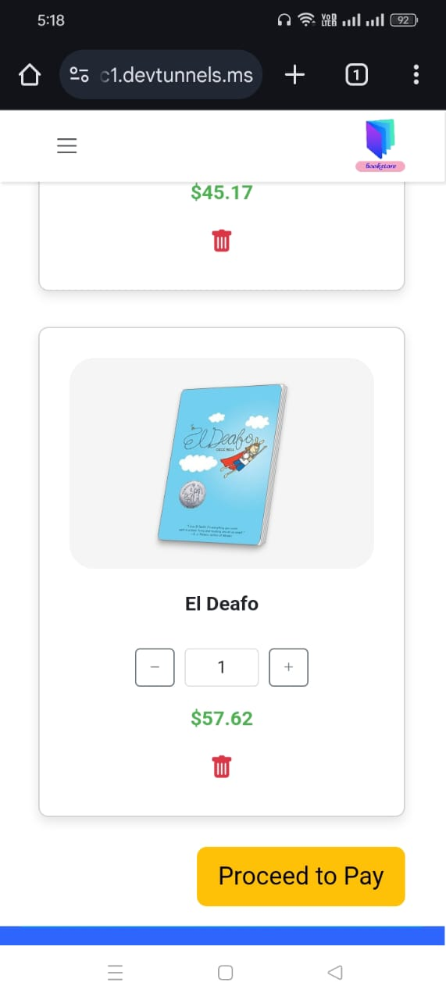
</div>

---

## 📁 Project Structure

```
book-ecommerce/
├── images/                         # Screenshots (desktop & mobile)
├── public/
│   ├── images/                     # Static assets
│   └── json/
│       ├── books.json              # Book data
│       ├── about.json              # About section data
│       └── testimonial.json        # Testimonials data
├── src/
│   ├── app/
│   │   ├── components/
│   │   │   ├── navbar/             # Navigation bar
│   │   │   ├── home/               # Homepage layout
│   │   │   ├── carousel/           # Hero image carousel
│   │   │   ├── home-page-books/    # Featured books on home
│   │   │   ├── book-page/          # Full book listing page
│   │   │   ├── book-card/          # Individual book card
│   │   │   ├── book-detail-page/   # Book detail view
│   │   │   ├── book-style/         # Book styling component
│   │   │   ├── book-placeholder/   # Loading placeholder
│   │   │   ├── categories/         # Category filter
│   │   │   ├── search/             # Search component
│   │   │   ├── cart/               # Cart page
│   │   │   ├── cart-card/          # Individual cart item
│   │   │   ├── order-form/         # Order placement form
│   │   │   ├── login-form/         # Login / signup modal
│   │   │   ├── testimonial/        # Testimonials section
│   │   │   ├── testimonial-card/   # Individual testimonial
│   │   │   ├── about-us-page/      # About page
│   │   │   ├── about-card/         # About section card
│   │   │   ├── contact-page/       # Contact form page
│   │   │   └── footer/             # Page footer
│   │   ├── interfaces/             # TypeScript interfaces
│   │   │   ├── books/
│   │   │   ├── cart/
│   │   │   ├── category/
│   │   │   ├── about/
│   │   │   └── testimonial/
│   │   ├── services/               # Angular services
│   │   │   ├── books/
│   │   │   ├── cart/
│   │   │   ├── order/
│   │   │   ├── about/
│   │   │   ├── testimonial/
│   │   │   └── loginModal/
│   │   ├── app.routes.ts           # Application routes
│   │   ├── app.config.ts           # App configuration
│   │   └── app.component.ts        # Root component
│   ├── firebase_config.ts          # Firebase configuration
│   ├── main.ts                     # Application entry point
│   └── styles.scss                 # Global styles
├── angular.json                    # Angular CLI config
├── tsconfig.json
└── package.json
```

---

## ⚙️ Prerequisites

| Tool | Version |
|------|---------|
| Node.js | 18+ |
| npm | 9+ |
| Angular CLI | 17+ |

Install Angular CLI globally if you haven't already:

```bash
npm install -g @angular/cli
```

---

## 🚀 Getting Started

### Step 1 — Clone the Repository

```bash
git clone <repository-url>
cd book-ecommerce
```

### Step 2 — Install Dependencies

```bash
npm install
```

### Step 3 — Start the Development Server

```bash
ng serve
```

> ✅ Open your browser at **`http://localhost:4200`**

---

## 🛠️ Built With

| Technology | Purpose |
|------------|---------|
| Angular 17+ | Frontend framework |
| TypeScript | Strongly-typed JavaScript |
| SCSS | Component-level styling |
| Firebase | Auth & backend config |
| Local Storage | Client-side data persistence |
| Vercel | Deployment & hosting |

---

## 🗂️ Services Overview

| Service | Responsibility |
|---------|---------------|
| `books.service.ts` | Fetch and filter book data from JSON |
| `cart.service.ts` | Manage cart state via Local Storage |
| `order.service.ts` | Handle order submission and storage |
| `about.service.ts` | Load about section data |
| `testimonial.service.ts` | Load testimonial data |
| `login-modal.service.ts` | Control login/signup modal visibility |

---

## 🔗 Routing Overview

| Route | Component |
|-------|-----------|
| `/` | Home |
| `/books` | Book listing page |
| `/books/:id` | Book detail page |
| `/cart` | Shopping cart |
| `/order` | Order form |
| `/about` | About us |
| `/contact` | Contact page |

---

## 🧪 Running Tests

```bash
ng test
```

---

## 📦 Build for Production

```bash
ng build
```

> Output will be generated in the `dist/` folder.

---

## 🛠️ Troubleshooting

**`ng` command not found?**
```bash
npm install -g @angular/cli
```

**Port 4200 already in use?**
```bash
ng serve --port 4201
```

**Dependencies not installing?**
- Ensure Node.js 18+ is installed: `node --version`
- Try clearing the npm cache: `npm cache clean --force` then re-run `npm install`

---

## 📌 Notes

- This project currently uses **Local Storage** for all data persistence — no backend database is required
- The `firebase_config.ts` file is included for future Firebase integration
- All book, testimonial, and about data is loaded from static JSON files in `public/json/`
