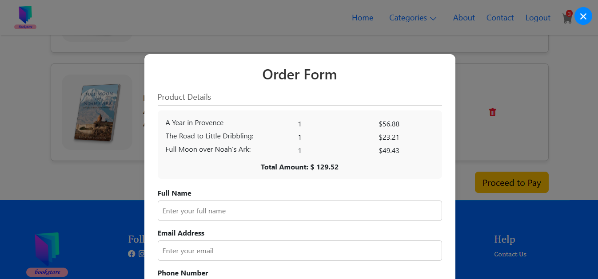
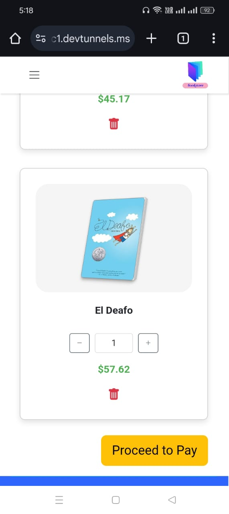

    <h1 style="color: #333;">Book Ecommerce Website</h1>
    
A Website for a Book Store made using Angular. This website works on local storage only.

    <h2 style="color: #333;">Images for Desktop:</h2>
    
    
    
    
    
    
    
    
    
    

    <h2 style="color: #333;">Images for Mobile:</h2>
    

        
        
        
        
        
        
        
        
        
        
    

