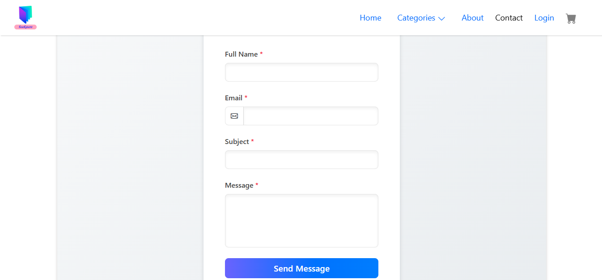
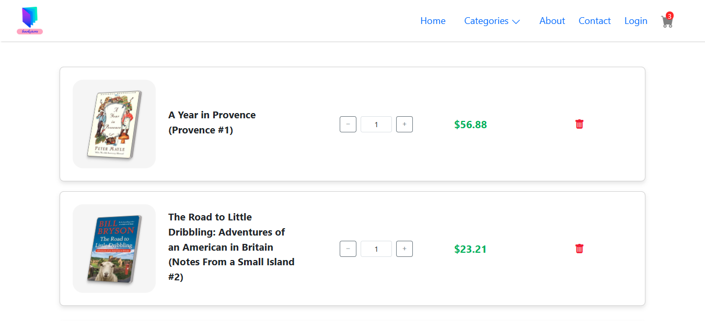

<h1>Book Ecommerce Website</h1>

A Webiste for Book Store Made using Angular. This Website Works on the Local Storage yet only.

<h2>Images for Desktop:</h2>
</img>
</img>
</img>
</img>
</img>
</img>
</img>
</img>
</img>
</img>

<h2>Images for Mobile:</h2>

</img>
</img>
</img>
</img>
</img>
</img>
</img>
</img>
</img>
</img>

